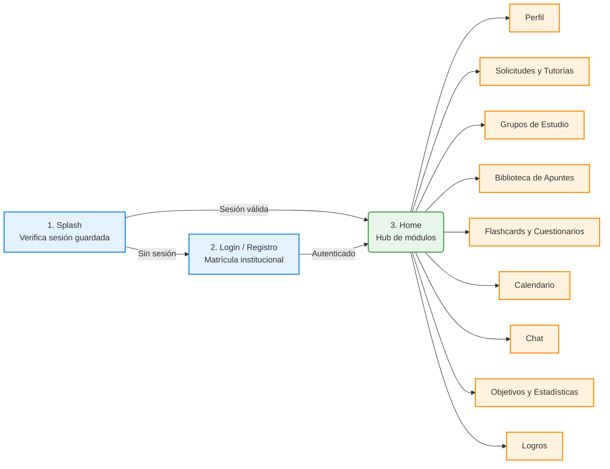
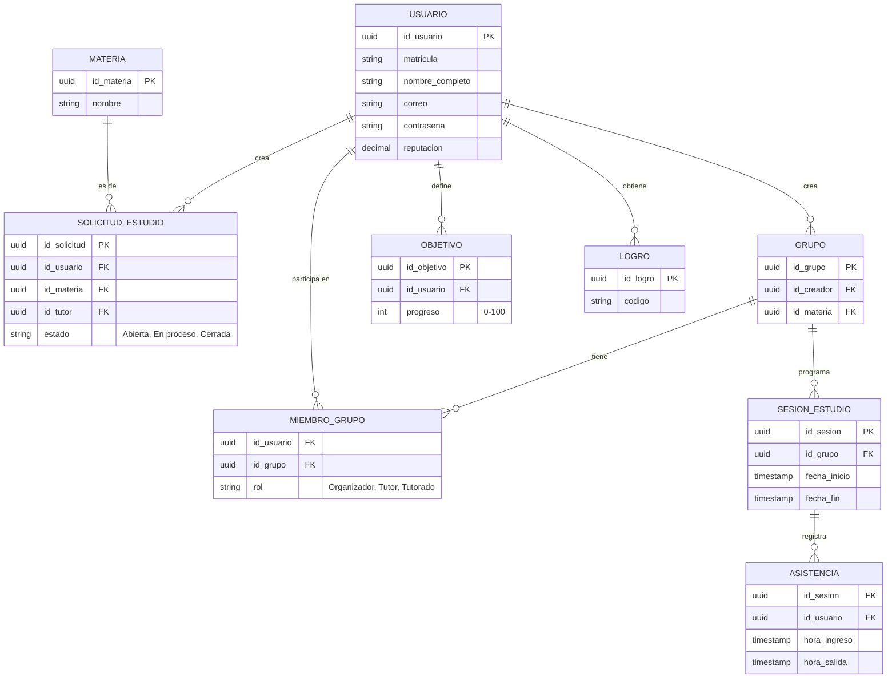

# Guía de Proyecto Final: "StudyLink"

**Materia:** Programación de Dispositivos Móviles
**Objetivo:** Documentar la estructura técnica del Proyecto para Ordinario, aplicado al proyecto StudyLink desarrollado por el equipo.

> Este documento complementa a `AppMovil.md`, `HistoriasDeUsuario.md`, `DiagramaCasosDeUso.md` y `ModeloEntidadRelacion.md` (especificación funcional del proyecto) y a `Progreso-Studylink.md` (bitácora técnica detallada, decisiones de diseño y estado por Historia de Usuario). Aquí se resume la arquitectura para exposición y evaluación.

---

## 1. Interfaz y UX/UI (Flujo de la Aplicación)

StudyLink es una plataforma con múltiples módulos independientes que convergen en una pantalla principal (Home) tras autenticarse. El flujo de entrada es lineal y simple; a partir de ahí, la navegación es tipo "hub": el usuario entra y sale de cada módulo según necesite.



**Pantallas implementadas** (módulo `auth`, ver `Progreso-Studylink.md` sección 6.1):
1. **Splash** — verifica si hay un JWT guardado (`TokenStorage`, `flutter_secure_storage`) y decide si manda a Login o directo a Home.
2. **Login** — correo + contraseña, valida contra `POST /api/auth/login`.
3. **Registro** — matrícula + nombre + correo + contraseña, valida contra `POST /api/auth/registro`.
4. **Home** — placeholder actual, punto de entrada donde se irán colgando el resto de los módulos conforme se construyan en Flutter (todos ya existen y están probados en el backend; falta su interfaz).

**Diseño responsivo (RNF-06):** Material Design 3 (`AppTheme`, tema claro/oscuro), igual que exige `AppMovil.md` RNF-01, sobre Flutter (multiplataforma nativa Android/iOS desde una sola base de código, RNF-04).

---

## 2. Arquitectura de Software (Patrón MVVM + Clean Architecture)

StudyLink usa **MVVM** (definido desde `AppMovil.md` sección 23.2), implementado con **Cubit** de `flutter_bloc` como ViewModel, dentro de una estructura de Clean Architecture por *feature* (`data/domain/presentation`, ver `Progreso-Studylink.md` 6.1).

```mermaid
flowchart TD
    subgraph Capa de Presentación (UI)
        V[Pantallas<br/>Flutter Widgets]
    end

    subgraph Capa de Lógica de Negocio
        VM[Cubit / ViewModel<br/>ej. AuthCubit — valida y expone AuthState]
    end

    subgraph Capa de Datos
        R[Repository<br/>Decide online vs offline]
        API[[Remote DataSource<br/>Dio → API REST Node.js]]
        DB[(Local DataSource<br/>Isar — pendiente, Épica 12)]
    end

    V <-->|1. Observa Estado / 2. Envía eventos| VM
    VM <-->|3. Solicita / Envía Datos| R
    R -->|4. Conectividad SÍ| API
    R -->|4. Conectividad NO| DB

    style V fill:#bbdefb
    style VM fill:#c8e6c9
    style API fill:#ffcc80
    style DB fill:#e1bee7
```

Ejemplo real con el módulo `auth` ya construido:
- La **Vista** (`LoginPage`) solo dice: *"el usuario presionó 'Iniciar sesión' con estos datos"*.
- El **Cubit** (`AuthCubit`) dice: *"validaré el formulario, llamaré al repositorio, y expondré `AuthState.loading` → `AuthState.autenticado` o `AuthState.error`"*.
- El **Repository** (`AuthRepositoryImpl`) dice: *"le pido el login al `AuthRemoteDatasource` (Dio contra `POST /api/auth/login`), y si funciona, guardo el token con `TokenStorage`"*.

---

## 3. Persistencia (Modelo de Base de Datos)

StudyLink tiene **dos niveles de persistencia** según `AppMovil.md` sección 23.1 y RNF-07:

### 3.1 Persistencia remota (implementada) — PostgreSQL

19 migraciones ejecutadas, 20+ tablas (detalle completo en `ModeloEntidadRelacion.md` y `Progreso-Studylink.md` sección 3). Diagrama simplificado del núcleo funcional:



**Notas de implementación** (ver `Progreso-Studylink.md` sección 4 para el detalle completo):
- Persistencia vía `pg` (queries SQL directas, sin ORM) desde el backend Node.js/Express/TypeScript.
- Varias columnas se agregaron sobre el MER original cuando la documentación funcional (`AppMovil.md`, `HistoriasDeUsuario.md`) exigía un dato que el modelo relacional no contemplaba (ej. `tipo_archivo` en `apunte`, `id_tutor` en `solicitud_estudio`) — cada caso está documentado y justificado.

### 3.2 Persistencia local / offline (pendiente — Épica 12, RNF-07)

`AppMovil.md` RNF-07 exige acceso y edición sin conexión para **flashcards individuales, objetivos y calendario**. La arquitectura ya está preparada para esto (ver sección 2: el Repository decide la fuente de datos), pero la implementación con **Isar** (BD NoSQL embebida para Flutter, según sección 23.1) todavía no se ha construido — es el siguiente hito grande del frontend.

Colecciones Isar planeadas (equivalentes offline de sus contrapartes remotas):
- `FlashcardLocal` / `TarjetaLocal`
- `ObjetivoLocal`
- `EventoCalendarioLocal`

Al recuperar conexión, el Repository sincroniza lo editado localmente contra PostgreSQL de forma transparente (mismo criterio ya definido en HU-32, "Repaso de Flashcards sin Conexión").

---

## 4. Consumo de Datos / Servicios Externos

StudyLink es *API-first*: el cliente Flutter no tiene lógica de negocio propia, todo pasa por una **API REST propia** construida en Node.js + Express + TypeScript.

### 4.1 API REST propia (implementada — 29 Historias de Usuario)

- **Autenticación:** JWT (`Authorization: Bearer <token>`), expiración 7 días. El interceptor de `Dio` (`ApiClient`) lo adjunta automáticamente a cada request.
- **Formato:** JSON puro, un módulo de rutas por dominio.
- **Cobertura actual** (detalle completo endpoint por endpoint en `Progreso-Studylink.md` sección 5):

| Módulo | Épica | Endpoints principales |
|---|---|---|
| Autenticación y Perfil | 1 | `/api/auth/*`, `/api/usuarios/*` |
| Solicitudes y Tutorías | 2 | `/api/solicitudes/*` |
| Grupos de Estudio | 3 | `/api/grupos/*`, `/api/sesiones/*` |
| Biblioteca de Recursos | 4 | `/api/apuntes/*` |
| Flashcards y Cuestionarios | 5 | `/api/flashcards/*`, `/api/cuestionarios/*` |
| Calendario | 6 | `/api/eventos/*`, `/api/recordatorios/*` |
| Comunicación | 7 | `/api/conversaciones/*`, `/api/mensajes/*` |
| Seguimiento Académico | 8 | `/api/objetivos/*`, `/api/estadisticas/*` |
| Evaluación y Reputación | 9 | `/api/calificaciones/*` |
| Asistencia | 10 | `/api/asistencia/*` |
| Gamificación | 11 | `/api/logros/*` |

### 4.2 Servicios externos (planeados, sin credenciales aún)

Documentados como decisión explícita en `Progreso-Studylink.md` (secciones 4 y 8) — no son omisiones accidentales:

- **Firebase Storage** (HU-11, Subir Apuntes): el diseño ya contempla que el cliente suba el archivo directo a Firebase y solo mande la `archivo_url` resultante al backend. Falta conectar credenciales reales (`serviceAccountKey.json`); hoy el backend acepta cualquier URL ya subida externamente.
- **Firebase Cloud Messaging** (HU-20, Recordatorios): mismo caso — el backend ya expone `GET /api/recordatorios/pendientes` para que el cliente decida cuándo notificar (local o vía FCM) vía *polling*, en vez de recibir push real.
- **Chat en tiempo real** (HU-21/22): actualmente REST + polling (`?desde=<fecha>`) en vez de WebSockets, por la misma razón de no depender de infraestructura adicional en esta etapa del proyecto.

### 4.3 Por qué polling y no push/WebSockets (por ahora)

Al no tener acceso a credenciales de Firebase Admin en el entorno de desarrollo, se decidió — de forma consistente en las 3 áreas que lo necesitaban (Recordatorios, Chat, Notificaciones) — que el backend **siempre tenga una versión funcional vía REST simple**, dejando la mejora a tiempo real como una capa adicional que no cambia el contrato de la API ya construido. Esto sigue el mismo principio de "MVP primero, infraestructura después" aplicado durante todo el proyecto (ver decisiones de diseño en `Progreso-Studylink.md`).

---

## Resumen de estado del proyecto (al momento de este documento)

- **Backend:** 100% de las Épicas 1 a 11 (29 Historias de Usuario) implementadas, probadas y documentadas.
- **Frontend Flutter:** estructura MVVM/Clean Architecture definida; módulo de autenticación (HU-01/02/03) construido, pendiente de compilar y probar con Flutter SDK real. Resto de módulos por construir (la API que consumirán ya existe y funciona).
- **Pendiente:** persistencia offline con Isar (Épica 12), conexión real a Firebase Storage/FCM.

Para el detalle línea por línea de cada decisión, migración SQL y endpoint, ver `Progreso-Studylink.md`.
